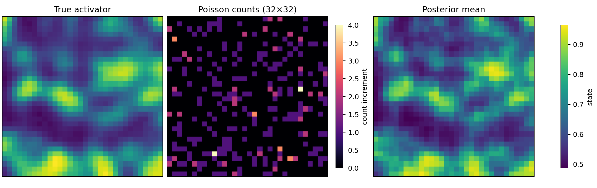
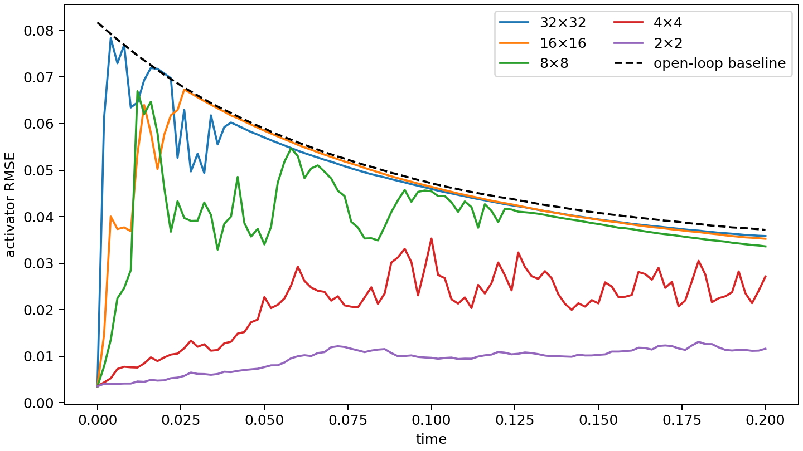

# SPDE Poisson filtering

[](https://github.com/jszala/SPDE_Poisson_filtering/actions/workflows/ci.yml)
[](LICENSE)

This repository is a compact, reproducible resolution study for a bootstrap
particle filter. The hidden signal is a stochastic two-field
FitzHugh–Nagumo (FHN) reaction–diffusion system on a square two-dimensional
domain; observations are spatial Poisson count increments. It refreshes the
numerical experiment from the `filtering_mpp` chapter of my PhD thesis while
keeping the original scientific flow visible:

```text
propagate particles → score Poisson increments → normalize log weights
                    → diagnose ESS → residual-resample when ESS < L/2
```

The v2 code is deliberately narrow. It contains one SPDE, one observation
model, one filter, and serial or local process-pool execution. There is no MPI,
cloud storage, remote execution, data upload, parameter fitting, or real-data
preprocessing.

## Model and observation convention

For activator `u` and inhibitor `v`, the implementation advances

$$
\begin{aligned}
du &= [D_u\Delta u + s(u-\alpha_1)(u-\alpha_2)(\alpha_3-u)-v+p]dt
      + \sigma_u\,dW_u,\\
dv &= [D_v\Delta v + \gamma(\beta u-v)]dt + \sigma_v\,dW_v.
\end{aligned}
$$

The preset fixes $\alpha=(0.5,0.75,1)$ and $\beta=10$. Diffusion is implicit;
reaction, coupling, and additive noise are explicit, and both coupled terms use
the previous timestep. The boundary condition is homogeneous Neumann. The
signal is never clipped.

The pointwise observation intensity is defined once:

$$
\lambda(t,x)=\operatorname{clip}\left(
e^{-at}[c\max(u(t,x),0)]^2,\lambda_{\min},\lambda_{\max}\right).
$$

The strictly positive floor and upper cap are intentional. They resolve the
ambiguous `∨ C_max` notation in the thesis and stabilize likelihood evaluation;
they do not modify the SPDE state. Fine-cell count means are
$\Delta t\int_{K_i}\lambda(t,x)\,dx$. Every coarse resolution is a block sum
of the same fine-grid counts and rates, so total counts are conserved and the
comparison uses identical underlying events.

## Install and run

Python 3.11 or 3.12 is supported.

```bash
python -m venv .venv
source .venv/bin/activate
python -m pip install -e .
spde-pf run --config configs/quick.yaml --output runs/quick --workers 4
```

The command prints a dry resource estimate before allocating the ensemble. To
inspect a profile without running it:

```bash
spde-pf run --config configs/thesis.yaml --output runs/thesis --workers 8 --dry-run
```

The `quick` profile uses a 32×32 grid, 512 particles, 100 observation steps,
and resolutions 32 through 2. It is designed for a laptop and the documentation
figures below. The `thesis` profile uses a 64×64 grid, 20,000 particles, 500
steps, and resolutions 64 through 2. Its conservative parent-process estimate
is about 3.75 GiB before worker copies and operating-system overhead; allow at
least 16 GB RAM and expect a multi-hour run. Resolutions run sequentially to
avoid nested-process oversubscription.





## Output and reproducibility

Each run writes compressed truth, observation, and per-resolution filter files,
plus `metrics.csv`, `manifest.json`, and two figures. Particle histories are not
retained. Per step, the filter stores posterior means and variances, ESS, log
normalizers, resampling decisions, RMSE, open-loop RMSE, and timing. The
open-loop comparator is one seeded, unobserved stochastic forecast drawn from
the same prior and shared by all resolutions.

Randomness is addressed by semantic coordinates `(master_seed, stage,
timestep, particle_index)`. It never depends on a PID or wall-clock time.
Particles are split into contiguous chunks; every worker initializes and caches
its sparse LU operators once, and returned chunks are reassembled in input
order. Tests require serial and two-worker posterior trajectories, ESS, and
resampling decisions to agree at floating-point precision.

The package layout keeps the scientific boundaries explicit:

```text
configs/                         immutable quick and thesis profiles
src/spde_poisson_filtering/
  spde.py                        FHN solver and local propagation backend
  observations.py                intensity and Poisson-consistent aggregation
  likelihood.py                  dependency-light likelihood primitives
  filter.py                      bootstrap particle filter
  experiment.py                  sequential study and output manifest
notebooks/reproduce_figures.ipynb thin output-loading notebook
docs/numerical_methods.md         equations, discretization, and calibration
```

## Differences from the thesis implementation

- The thesis text states 20,000 particles, while the checked-in legacy notebook
  used 10–20 particles in runnable cells. The v2 thesis profile standardizes on
  20,000.
- V2 uses ESS-triggered residual resampling at $L/2$ instead of unconditional
  resampling.
- Likelihoods accumulate in float64 log space and normalize with log-sum-exp.
- Diffusion uses cached sparse LU factorizations in a fixed semi-implicit step.
- Seeds are deterministic across serial and local multiprocessing backends.
- The intensity uses an explicit positive floor and upper cap, and every
  resolution aggregates the same fine events.
- Legacy simulations, result dumps, cache files, the executed monolithic
  notebook, and duplicated utilities remain accessible through the
  `legacy-thesis-v1` tag rather than the v2 branch.

## Development and citation

```bash
python -m pip install -e '.[dev]'
ruff check .
ruff format --check .
pytest
```

The tests cover the Neumann Laplacian, a direct sparse step reference, white
noise scaling, likelihood equivalence with SciPy, aggregation conservation,
residual resampling, calibrated signal diagnostics, deterministic local
parallelism, and an end-to-end output run. See
[the numerical-methods note](docs/numerical_methods.md) for array semantics and
calibration details. Citation metadata is in [CITATION.cff](CITATION.cff); the
project is distributed under the [BSD-3-Clause license](LICENSE).
